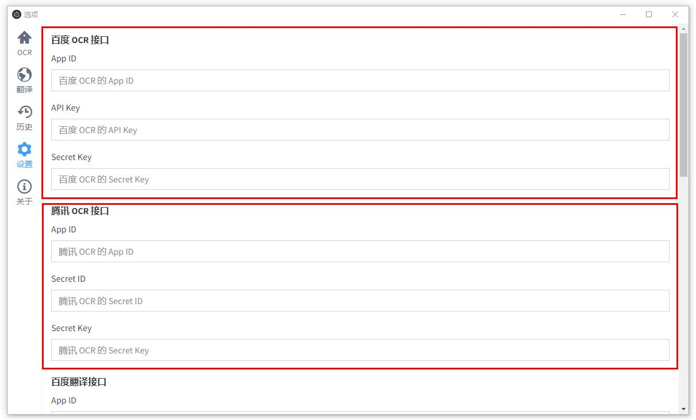
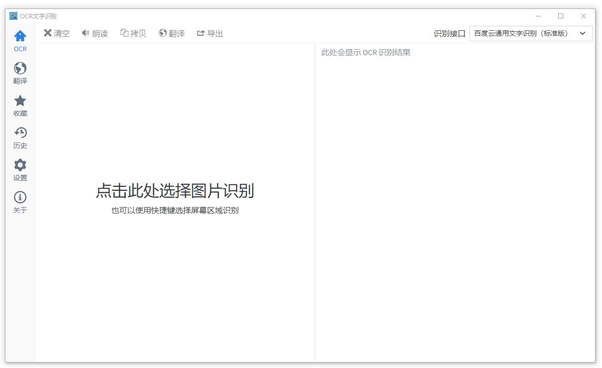
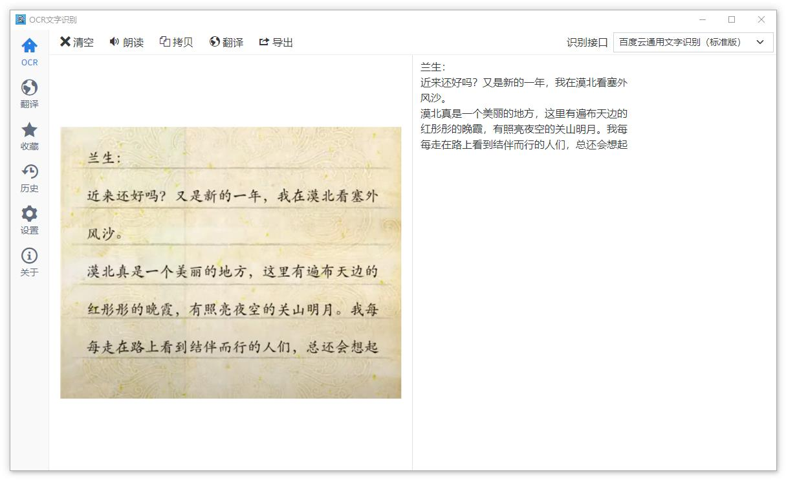
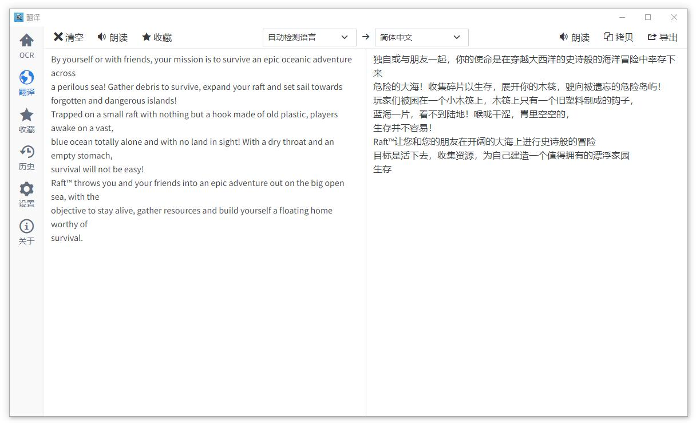
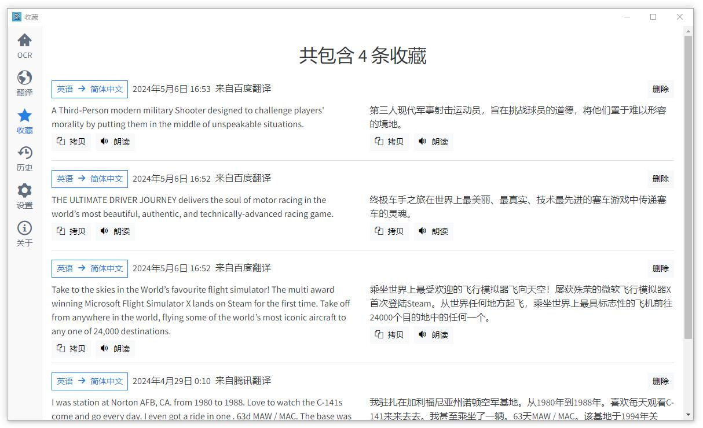
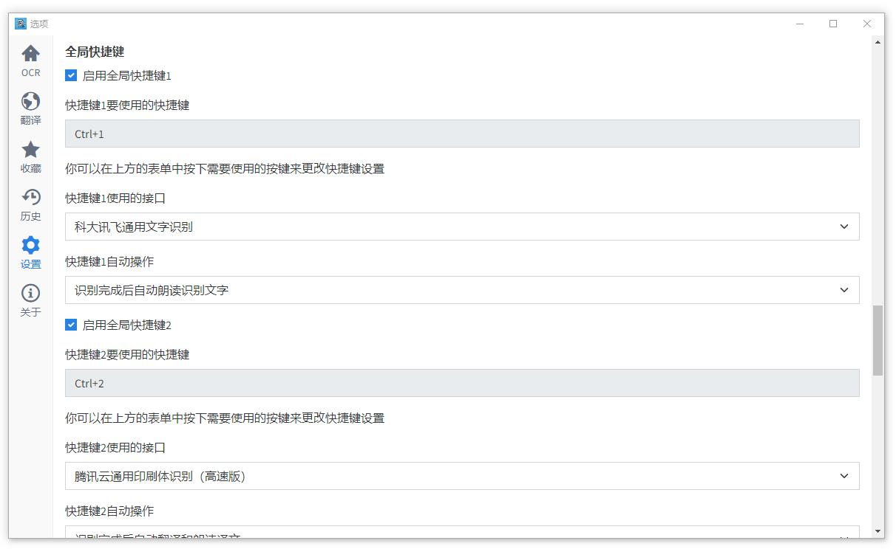
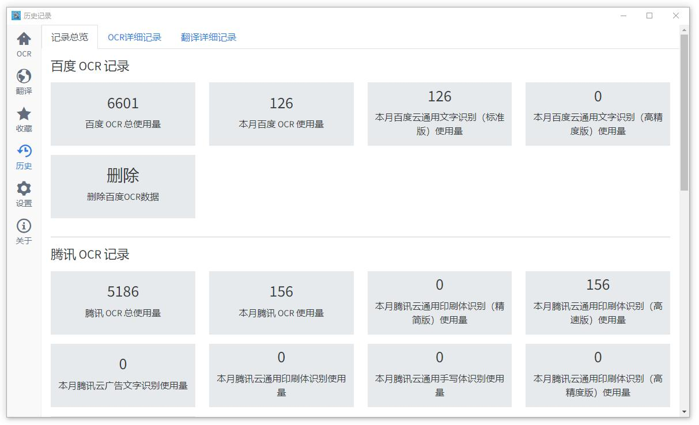
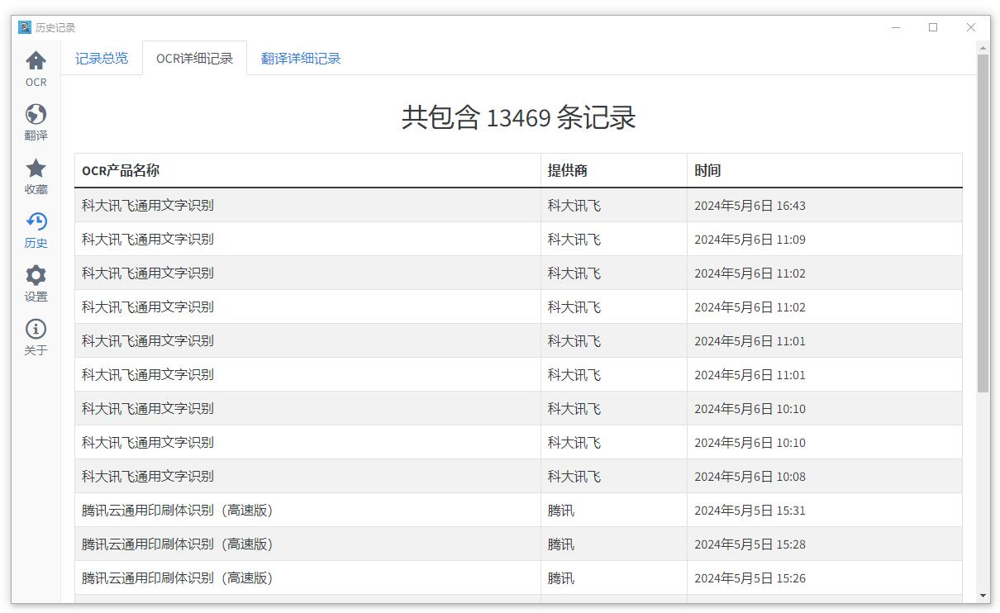

  OCR 翻译（ocr-translation）是一个使用 Electron 开发的 OCR 文字识别 + 翻译的软件，也是我为了解决个人需求开发的软件。

软件本身并不完全具备 OCR 识别和翻译的功能，OCR 功能需要调用在线的 OCR 识别服务，翻译也需要调用百度翻译或腾讯翻译。

软件没有内置 API 密钥信息，使用 OCR 功能需要填写相关的 API 密钥信息，使用翻译功能需要填写百度翻译或腾讯翻译的 API 密钥信息。

下面是 API 申请地址：

* 百度 OCR API：[https://ai.baidu.com/tech/ocr_general](https://ai.baidu.com/tech/ocr_general)
* 腾讯 OCR API：[https://cloud.tencent.com/product/ocr-catalog](https://cloud.tencent.com/product/ocr-catalog)
* 科大讯飞 OCR API [https://www.xfyun.cn/services/common-ocr](https://www.xfyun.cn/services/common-ocr)
* 有道智云 OCR API [https://ai.youdao.com/product-ocr-print.s](https://ai.youdao.com/product-ocr-print.s)
* 百度翻译 API：[https://fanyi-api.baidu.com/](https://fanyi-api.baidu.com/)
* 腾讯机器翻译 API [https://cloud.tencent.com/product/tmt](https://cloud.tencent.com/product/tmt)

腾讯的文字识别和翻译使用的是相同的密钥。

下面是 API 的免费额度说明：

* 百度通用文字识别：每月 1000 次免费
* 腾讯通用文字识别：每月 1000 次免费
* 讯飞通用文字识别：注册后免费 10 万次
* 百度翻译 API：标准版每月 5 万字免费，实名认证可提升到 100 万字
* 腾讯机器翻译，每月免费 500 万字

以上信息写于 2022 年 8 月 28 日，API 额度可能随时会更改，一切以官网为准。

## 支持的功能

下面是支持的 API 功能：

* 百度通用文字识别 - 通用文字识别（标准版）
* 百度通用文字识别 - 通用文字识别（高精度版）
* 腾讯通用文字识别 - 通用印刷体识别（标准版）
* 腾讯通用文字识别 - 通用印刷体识别（高精度版）
* 腾讯通用文字识别 - 广告文字识别
* 腾讯通用文字识别 - 手写体识别
* 腾讯文字识别API2022 - 通用印刷体识别（精简版）
* 腾讯文字识别API2022 - 通用印刷体识别（高速版）
* 科大讯飞 - 通用文字识别
* 有道智云 - 通用文字识别
* 百度翻译 - 通用文本翻译
* 腾讯机器翻译 - 文本翻译

## 使用说明

[Releases](https://github.com/changbin1997/ocr-translation/releases) 中提供了 Windows 安装包 `ocr-translation-win.exe` 和免安装的 `ocr-translation-win-portable.zip` ，安装包安装完成后在桌面会创建快捷方式，免安装的 zip 解压后找到 `ocr-translation.exe` 打开就可以使用。

如果没有填写任何 OCR API 密钥，进入 OCR 页面就会弹出对话框提示，您可以在设置中填写百度或腾讯的 OCR 密钥，如下：

填写完成后就可以使用 OCR 识别了，OCR 识别页面如下：

右上方可以选择 API 接口，点击左侧选择图片文件，也可以直接把图片文件拖到左侧识别，识别后的文本内容会显示在右侧，如下：

点击 **朗读** 可以朗读识别文本，语音在本地合成，无需等待，不限次数。

**导出** 功能可以把文字识别结果导出为 TXT 文件或包含图片和识别文字的 HTML 文件。

点击上方工具栏 **翻译** 会跳转到翻译页面，识别文本会自动传到原文输入框，点击语言选择区域的右箭头就可以直接翻译了。

你也可以从左侧的侧边栏进入翻译页面，手动输入内容翻译，如下：

翻译页面的语音也是在本地合成的。

翻译的 **导出** 可以把翻译原文和译文导出为 TXT 或 HTML 文件。

**收藏** 可以把本次翻译的原文和译文保存到软件的 SQLite 数据库中，在左侧侧边栏的 **收藏**可以查看保存的翻译：

## 选择屏幕区域识别

除了选择图片识别外，你也可以通过快捷键来选择屏幕区域识别，在 **设置** 中开启 **全局快捷键**，快捷键的按键可以自定义，使用的 API 接口也可以自定义，你还可以设置识别完成后自动翻译和朗读之类的。

在软件运行的情况下，你只需要按下设置的快捷键就会弹出一个类似于截图的界面，你可以选择要识别的区域，选择完成后按下 **完成** 就可以识别选择的屏幕区域。

如果你设置了识别完成后翻译的话，识别完成后就会自动翻译，默认翻译为中文，你也可以不开启自动翻译，识别完成后手动点击翻译可以选择语言。

软件最小化或在其它窗口也可以按快捷键识别翻译。

如果你在玩游戏或看视频的时候，遇到需要翻译的文字也可以按快捷键选择屏幕区域识别翻译，翻译完成后也可以选择自动朗读，无需切换窗口查看翻译结果。

## 固定屏幕区域识别

固定屏幕区域识别就是预先设置一个屏幕区域，按下快捷键后软件可以自动截取设置的区域识别翻译，不需要每次都选择区域识别翻译。

如果你需要翻译视频或游戏的字幕就可以使用固定区域识别翻译，在字幕变换的时候，你只需要按下快捷键就能翻译朗读。

## 使用统计

为了避免额度用完导致扣费，OCR翻译还提供了一个历史记录页面来查看使用统计，如下：

你还可以查看更详细的 OCR 或翻译历史记录：

## 注意事项

语音合成功能需要你的电脑上安装了语音库才能使用，一般的 Windows 10 以上的系统都会有语音库，只有一些修改过的精简版或 GHOST 的系统才会删除语音库。

软件虽然是用 Electron 开发的，但在 Linux 和 Mac 并不能使用完整功能，软件的选择屏幕区域识别功能用到了微信截图的 dll，在 Linux 和 Mac 可能无法使用。

软件没有服务器，不会联网，只有 OCR 识别和翻译的时候会连接到 API 服务器。软件的数据保存使用的是 SQLite 数据库，第一次进入软件后会在软件目录生成一个 `data.db` 的数据文件，软件设置和历史记录就保存在 `data.db` 中。